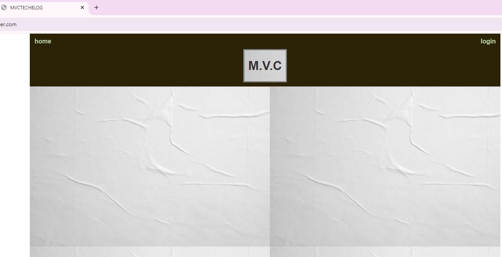
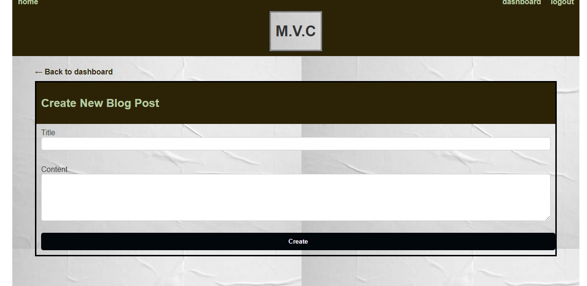

# mvctechblog

## Description

I have created a CMS-style blog site similar to a Wordpress site, so that developers can publish their blog posts and share their thoughts about any topic they like. I used
Handlebars.js , Sequelize, and the express-session npm package.

## Link

https://mvctechblog.onrender.com

## Screenshot

